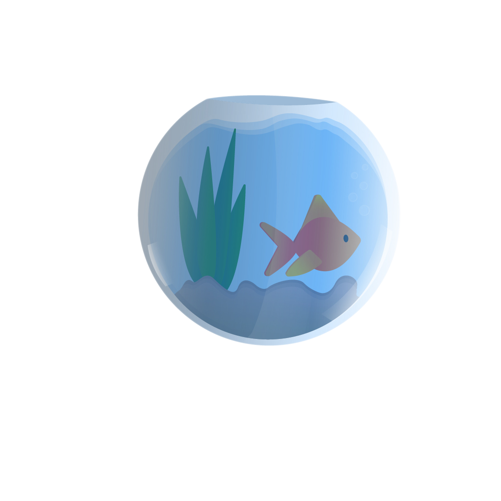

<!-- PROJECT LOGO -->
 

  <h3 align="center">Sea Explorers</h3>
  

    
  

<!-- TABLE OF CONTENTS -->

  
Table of Contents

  <ol>
    <li>
      <a href="#about-the-project">About The Project</a>
      <ul>
        <li><a href="#built-with">Built With</a></li>
      </ul>
    </li>
    <li>
      <a href="#getting-started">Getting Started</a>
</li>
    <li><a href="#roadmap">Roadmap</a></li>
    <li><a href="#contact">Contact</a></li>
    <li><a href="#acknowledgments">Acknowledgments</a></li>
  </ol>

<!-- ABOUT THE PROJECT -->

## About The Project

[Sea Explorers Website](https://seasexplorers.com/)

Exploring the depths in search of hidden gems

(<a href="#top">back to top</a>)

### Built With

-  Html
-  Css
-  Javascript
-  [Scroll Reveal](https://nextjs.org/)

(<a href="#top">back to top</a>)

<!-- USAGE EXAMPLES -->

## About Us

Making money and helping the sea together
Sea Explorers is a collection of 3033 unique explorers stored on the Elrond blockchain, together we try to save the ocean and find the treasure hidden in the depths. All explorers have unique utilities and can help in the process of cleaning the ocean.

All the action takes place on the seabed developing and helping the marine ecosystem, we are a community of explorers which you can enter by buying an nft, we try to develop and save the ocean together by our actions.

If you enter the sea explorers club by buying one nft you can access real life utility, private meetings with your favorite entrepreneurs, there will also be a holding system that can be a very good passive income, let us not forget why we created this project, together we try to save the oceans you can also be part of this stacking, giveaways and many others, we are waiting for you warmly in the marine exploratory community.

(<a href="#top">back to top</a>)

<!-- ROADMAP -->

## Roadmap

-  [x] Design & Community
-  [x] Website and Social media
-  [x] Giveaways events and community activities
-  [x] Partnerships
-  [ ] First pre-sale event
-  [ ] Airdrops, Hold 2 Earn & Stacking
-  [ ] Second pre-sale event
-  [ ] Introduce real utility
-  [ ] Public sale event
-  [ ] Meetings with entrepreneurs
-  [ ] Special projects allocation
-  [ ] Entering the ocean metaverse

(<a href="#top">back to top</a>)

<!-- CONTACT -->

## Contact

Your Name: [@dragos_matteo](https://twitter.com/dragos_matteo) - contact@dragosmatteo.com

Personal Site: [http://dragosmatteo.com/](http://dragosmatteo.com/)

Project Link: [https://github.com/dragosmatteo/seaexplorers](https://github.com/dragosmatteo/seaexplorers)

(<a href="#top">back to top</a>)

<!-- ACKNOWLEDGMENTS -->

## Acknowledgments

Use this space to list resources you find helpful and would like to give credit to. I've included a few of my favorites to kick things off!

-  [GitHub Pages](https://pages.github.com)
-  [Font Awesome](https://fontawesome.com)
-  [Scroll Reveal](https://scrollrevealjs.org/)

(<a href="#top">back to top</a>)

